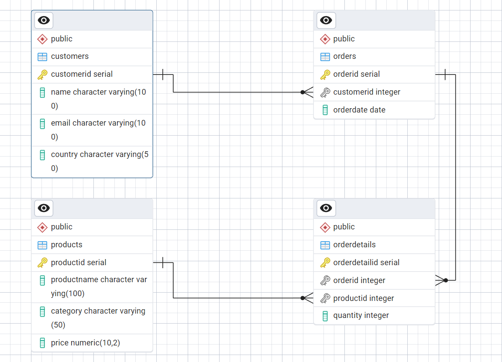

# 🛒 Retail Sales Analysis using SQL

This is a **case study project** focused on analyzing transactional retail sales data using **SQL**. It covers everything from creating the schema to querying business insights.

---

## 📌 Objectives

- Build a relational database schema for retail transactions.
- Clean and explore the dataset.
- Write SQL queries to generate insights on sales trends, customers, and product categories.

---

## 📊 Entity Relationship Diagram (ERD)

---

## 🧾 Dataset Overview

| Field            | Description                     |
|------------------|---------------------------------|
| transactions_id  | Unique transaction ID           |
| sale_date        | Date of transaction             |
| sale_time        | Time of transaction             |
| customer_id      | Unique customer identifier      |
| gender           | Gender of customer              |
| age              | Age of customer                 |
| category         | Product category                |
| quantity         | Number of items sold            |
| price_per_unit   | Price per item                  |
| cogs             | Cost of goods sold              |
| total_sale       | Total sales value               |

---

## 🧠 Key SQL Tasks

- ✅ Create database and table
- ✅ Remove NULL entries
- ✅ Count transactions, customers, and categories
- ✅ Category-wise and gender-wise insights
- ✅ Time-based sales shift analysis
- ✅ Top 5 customers by total spending

---

## 💻 Files Included

| File Name                     | Description                              |
|------------------------------|------------------------------------------|
| `Retail_sales.sql`           | Full SQL schema and analysis queries     |
| `Retail Sales Analysis.txt`  | Project write-up with explanation        |
| `Schemas.png`                | Visual ERD of database structure         |

---

## 📬 Contact

**Vaibhav Karale**  
📧 karalevaibhav02@gmail.com  
🔗 [LinkedIn](https://www.linkedin.com/in/vaibhavkarale)
